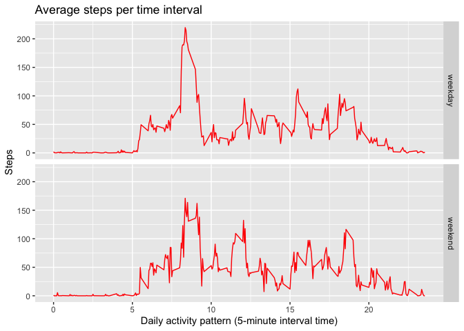

## Loading and preprocessing the data


```r
library(readr)

library(ggplot2)

activity <- read_csv("activity.csv")
```

```
## 
## ── Column specification ────────────────────────────────────────────────────────
## cols(
##   steps = col_double(),
##   date = col_date(format = ""),
##   interval = col_double()
## )
```

## What is mean total number of steps taken per day?


```r
## 1. Calculate the total number of steps taken per day

Totalsteps <- with(activity, aggregate(steps, by = list(date), FUN = sum, na.rm = TRUE))

names(Totalsteps) <- c("date", "steps")

## 2. Histogram

g <- ggplot(Totalsteps, aes(steps)) + geom_histogram(boundary=0, binwidth=1000, col="darkgreen", fill="lightgreen")  + xlab("Steps") + ylab("Frequency") + ggtitle("Total number of steps taken each day")

print(g)
```

<!-- -->

```r
## 3. Calculate and report the mean and median of the total number of steps taken per day

## Mean
mean(Totalsteps$steps)
```

```
## [1] 9354.23
```

```r
## Median
median(Totalsteps$steps)
```

```
## [1] 10395
```

## What is the average daily activity pattern?


```r
## 1. Make a time series plot (i.e. type = "l") of the 5-minute interval (x-axis) and the average number of steps taken, averaged across all days (y-axis)

AveragePattern <- aggregate(steps~interval,data=activity,FUN=mean,na.action=na.omit)

AveragePattern$time <- AveragePattern$interval/100

g <- ggplot(AveragePattern, aes(time, steps)) + geom_line(col="red") + xlab("Daily activity pattern (5-minute interval time)") + ylab("Steps") + ggtitle("Average steps per time interval")  

print(g)
```

<!-- -->

```r
## 2. Which 5-minute interval, on average across all the days in the dataset,contains the maximum number of steps?

library(dplyr)
```

```
## 
## Attaching package: 'dplyr'
```

```
## The following objects are masked from 'package:stats':
## 
##     filter, lag
```

```
## The following objects are masked from 'package:base':
## 
##     intersect, setdiff, setequal, union
```

```r
AveragePattern %>% select(time, steps) %>% filter(steps==max(AveragePattern$steps))
```

```
##   time    steps
## 1 8.35 206.1698
```

## Imputing missing values


```r
## Note that there are a number of days/intervals where there are missing values (coded as NA). The presence of missing days may introduce bias into some calculations or summaries of the data.

## 1. Calculate and report the total number of missing values in the dataset (i.e. the total number of rows with NAs)

missingvalues<-sum(is.na(activity$steps))
missingvalues
```

```
## [1] 2304
```

```r
## 2. Devise a strategy for filling in all of the missing values in the dataset. The strategy does not need to be sophisticated. For example, you could use the mean/median for that day, or the mean for that 5-minute interval, etc.

## The strategy for filling the missing values was to impute the rounded values of the average 5-minute interval to replace the NA values.

activity$CompleteSteps <- ifelse(is.na(activity$steps), round(AveragePattern$steps[match(activity$interval, AveragePattern$interval)],0), activity$steps)

## 3. Create a new dataset that is equal to the original dataset but with the missing data filled in.
ActivityComplete <- data.frame(steps=activity$CompleteSteps, interval=activity$interval, date=activity$date)

Complete <- aggregate(ActivityComplete$steps, list(ActivityComplete$date), FUN=sum)
colnames(Complete) <- c("Date", "Steps")

## 4. Make a histogram of the total number of steps taken each day and 
g <- ggplot(Complete, aes(Steps))+geom_histogram(boundary=0, binwidth=1000, col="blue", fill="lightblue")+xlab("Steps")+ylab("Frequency")+scale_x_continuous(breaks=seq(0,25000,2500))+ggtitle("Total number of steps taken each day")

print(g)
```

<!-- -->

```r
## Calculate and report the **mean** and **median** total number of steps taken per day. Do these values differ from the estimates from the first part of the assignment? What is the impact of imputing missing data on the estimates of the total daily number of steps?

## Mean
mean(Complete$Steps)
```

```
## [1] 10765.64
```

```r
##Median
median(Complete$Steps)
```

```
## [1] 10762
```

```r
##Do these values differ from the estimates from the first part of the assignment? What is the impact of imputing missing data on the estimates of the total daily number of steps?

##The new mean is 10765.64 steps compared to the old mean of 9354.23 steps. That creates a difference of 1411 steps on average per day. The new median is 10762 steps compared to the old median of 10395 steps. That creates a difference of 367 steps. However, the overall shape of the distribution has not changed. 
```

## Are there differences in activity patterns between weekdays and weekends?

```r
## For this part the weekdays() function may be of some help here. Use the dataset with the filled-in missing values for this part.

## 1. Create a new factor variable in the dataset with two levels – “weekday” and “weekend” indicating whether a given date is a weekday or weekend day.
ActivityComplete$date <- as.POSIXct(ActivityComplete$date, "%Y-%m-%d")
weekday <- weekdays(ActivityComplete$date)
ActivityComplete <- cbind(ActivityComplete,weekday)
ActivityComplete$DayType <- ifelse(ActivityComplete$weekday=="Saturday" | ActivityComplete$weekday=="Sunday", "weekend","weekday")

## 2. Make a panel plot containing a time series plot (i.e. type = "l") of the 5-minute interval (x-axis) and the average number of steps taken, averaged across all weekday days or weekend days (y-axis). 
AveragePatternAll <- aggregate(steps~interval + DayType, data=ActivityComplete,FUN=mean,na.action=na.omit)
AveragePatternAll$time <- AveragePatternAll$interval/100

g <- ggplot(AveragePatternAll, aes(time, steps)) + geom_line(col="red") + xlab("Daily activity pattern (5-minute interval time)") + ylab("Steps") + ggtitle("Average steps per time interval")+facet_grid(DayType ~ .)

print(g)
```

<!-- -->
